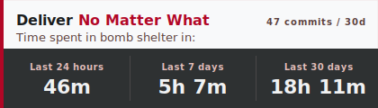

# Am Israel Hai Badge



A GitHub profile badge that tracks how much time you spend in a bomb shelter, based on real-time Home Front Command alerts for your location. Updates automatically every 30 minutes via GitHub Actions.

Designed for your **profile README** (`YOUR_USERNAME/YOUR_USERNAME` repo) — the one that appears on your GitHub profile page.

*Data from [tzevaadom.co.il](https://tzevaadom.co.il/) API · City translations from [peppermint-ice/how-the-lion-roars](https://github.com/peppermint-ice/how-the-lion-roars)*

---
## Quick Start
## Finding Your Area Name

Before setting up, find your area name. These correspond to Home Front Command alert zones and work in any language — English, Hebrew, Russian, or Arabic.

- [`areas.txt`](areas.txt) — full list of Hebrew area names, one per line
- [cities.json](https://github.com/peppermint-ice/how-the-lion-roars/blob/main/cities.json) — searchable, includes English, Russian, and Arabic translations

Common examples:

| English | Hebrew |
|---------|--------|
| Haifa - West | חיפה - מערב |
| Tel Aviv - City Center | תל אביב - מרכז העיר |
| Beer Sheva - South | באר שבע - דרום |
| Jerusalem - Center | ירושלים - מרכז |
| Ashkelon | אשקלון |
| Sderot | שדרות |

For multiple areas, separate with commas: `Haifa - West, Haifa - Bay`.

---


### Option A: GitHub GUI

1. **Create from template** — click the green **Use this template > Create a new repository** button at the top of this page. Name it `YOUR_USERNAME` to use as your profile README repo (or any other name you like).

2. **Enable Actions** — in your new repo go to **Settings > Actions > General**:
   - Actions permissions: **Allow all actions and reusable workflows**
   - Workflow permissions: **Read and write permissions**
   - Click **Save**

3. **Set your area** — go to **Settings > Secrets and variables > Actions > Variables tab** and click **New repository variable**:
   - Name: `BADGE_AREAS`
   - Value: your area name from the [step above](#finding-your-area-name) (e.g. `Haifa - West`)

4. **Run** — go to **Actions > Update Shelter Badge > Run workflow** and click **Run workflow**.
   The first run downloads cached data from the central repo — takes under a minute.

5. **Embed** — add this to your README (replace `YOUR_USERNAME` and `REPO_NAME`):
   ```markdown
   
   ```
   Or if embedding in the same repo's README:
   ```markdown
   
   ```

> **Why "Use this template" and not "Fork"?** The badge auto-updates every 30 minutes, creating commits with your area's data. A fork stays linked to the source repo, so GitHub will constantly show your repo as "X commits ahead, Y commits behind" and prompt you to create pull requests. A template copy is fully independent — no upstream link, no sync noise.

### Option B: CLI

```bash
# Create from template and clone
gh repo create YOUR_USERNAME --template EydlinIlya/am-israel-hai-badge --public --clone
cd YOUR_USERNAME

# Set your area (any language works)
gh variable set BADGE_AREAS --body "Haifa - West"

# Enable Actions workflow
gh workflow enable update_badges.yml

# Run the first update
gh workflow run update_badges.yml

# Check status
gh run list --workflow=update_badges.yml --limit=1
```

### Already forked?

If you already forked instead of using the template, you have two options:

- **Keep using the fork** — everything works the same. Set the `BADGE_AREAS` variable as described above. Just ignore the "ahead/behind" messages on GitHub and don't create pull requests back to the source.
- **Start fresh** — delete the fork (**Settings > General > Danger Zone > Delete this repository**), then create from template using the steps above. Your `BADGE_AREAS` variable will need to be set again on the new repo.

---

## Changing Your Area

Update the `BADGE_AREAS` variable (**Settings > Secrets and variables > Actions > Variables**) with the new name, then run the workflow. No resync needed — the CSV data already covers all cities.

---

## Getting Code Updates

If you created from template (recommended), your repo is independent. To pull in code updates from the source:

```bash
# One-time: add the source as a remote
git remote add upstream https://github.com/EydlinIlya/am-israel-hai-badge.git

# Pull updates (only source code — your badge/data stay untouched)
git fetch upstream
git merge upstream/master --allow-unrelated-histories
```

Or simply create a fresh repo from the template — your `BADGE_AREAS` variable is stored in GitHub settings, not in files, so nothing is lost.

---

## How Shelter Time Is Calculated

### Data Sources

The badge pulls from two [tzevaadom.co.il](https://tzevaadom.co.il/) API endpoints:

| Endpoint | What it provides |
|----------|-----------------|
| `/alerts-history/id/{N}` | Rocket and UAV alerts per city (categories 1–2) |
| `/system-messages/id/{N}` | "Early Warning" (category 14) and "Incident Ended" (category 13) messages |

City area names are resolved using [peppermint-ice/how-the-lion-roars](https://github.com/peppermint-ice/how-the-lion-roars) `cities.json`, which provides city ID mappings and multi-language translations.

Data is cached incrementally in CSV files (`data/tzevaadom_alerts.csv` and `data/tzevaadom_messages.csv`). Each run only fetches new IDs since the last update.

### The State Machine

Shelter sessions are computed using a two-state machine:

```
                ┌──────────────────────────┐
                │                          │
    ACTIVE_ALERT or PREPARATORY       additional alerts
    (rocket siren / early warning)    (update last_activity,
                │                      don't reset entry)
                ▼                          │
  ┌──────┐           ┌────────────┐        │
  │ IDLE │──entry──▸ │ IN_SHELTER │◂───────┘
  └──────┘           └────────────┘
      ▲                    │
      │         SAFETY signal (incident ended)
      │         OR 45-min gap (auto-close)
      └────────────────────┘
```

- **Entry**: a PREPARATORY (early warning) or ACTIVE_ALERT (rocket/UAV siren) signal for your area transitions from IDLE to IN_SHELTER. The entry timestamp is recorded.
- **While in shelter**: additional alerts update the "last activity" time but don't reset the entry time. A single continuous barrage counts as one session.
- **Exit**: a SAFETY signal ("Incident Ended") closes the session. If no signal arrives for more than **45 minutes**, the session auto-closes 10 minutes after the last activity.
- **Broadcast messages**: nationwide "Incident Ended" broadcasts (sent to all areas) can close sessions. Nationwide early warnings are ignored to avoid phantom sessions for areas that had no actual siren.

### Time Windows

The badge shows three time windows — **24 hours**, **7 days**, and **30 days**. Sessions that cross a window boundary are clipped (not dropped), so a 2-hour session that started 23.5 hours ago contributes 30 minutes to the 24-hour window and the full 2 hours to the 7-day and 30-day windows.

### Commit Count

The top-right number shows your total GitHub commit contributions (public + private) over the last 30 days, fetched via the GitHub GraphQL API using the `GITHUB_TOKEN` provided by Actions. Your username is auto-detected from the repository name.

---

## Links

- [tzevaadom.co.il](https://tzevaadom.co.il/) — the alert data API
- [peppermint-ice/how-the-lion-roars](https://github.com/peppermint-ice/how-the-lion-roars) — city data with area IDs and multi-language translations
- [areas.txt](areas.txt) — full list of area names
